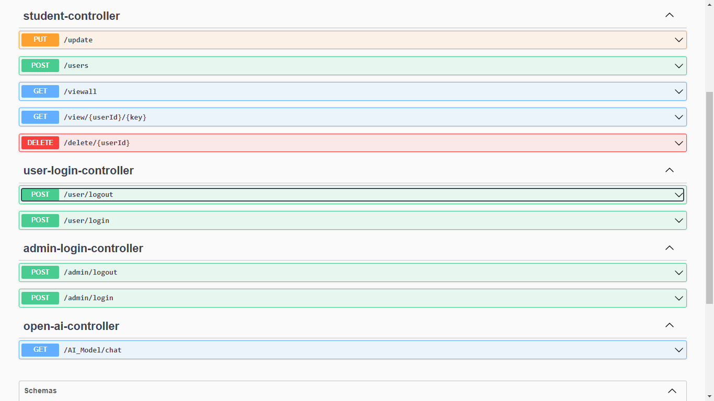

# Hackathon_AI_Project
**Empowering interviews with OpenAI magic**

<p align="center">
 <a href="https://git.io/typing-svg"></a><br></br>

</p>

## Contributors

- [Rajmal Pankaj [Java]](https://github.com/Rajmalpankaj786)
- [Vamshi Krishna[mern]](https://github.com/vk10082000)
- [Gaurav Raj [mern]](https://github.com/gauravraj2601)
- [Sandhya Patil [mern]](https://github.com/patil-sandhya)


<br>

## OverView 
Welcome to Interview SynthAI – Your Ultimate Interview Success Partner!

Embark on a journey to ace your interviews with Interview SynthAI, a comprehensive project dedicated to elevating your interview preparation experience. Whether you're gearing up for technical interviews in software engineering or aiming to excel in IT positions, our platform is your go-to resource for a wealth of interview questions and invaluable feedback to sharpen your skills.

Navigate our user-friendly interface effortlessly, where you'll find a treasure trove of curated interview questions and expert guidance. Our project is designed to cater to the diverse needs of aspiring candidates, providing a one-stop solution for honing interview skills and boosting confidence.

## Features
Extensive question bank covering various topics:

Data Structures and Algorithms
System Design
Core Java
Spring Boot
TypeScript & JavaScript
And more!
User-friendly web interface built with React for an intuitive experience.

Tailwind CSS for sleek and responsive design.

Open API integration to provide up-to-date and relevant content.


### <h2 style="margin-top:100px ;"><i>👨🏻‍💻 Tech Stack & Languages used</i></h2>


### <h2><i>🚀 Libraries & Frameworks</i></h2>
<a href="" target="blank"></a>
<a href="" target="blank"></a>
<a href="" target="blank"></a>
<a href="" target="blank"></a>
<a href="" target="blank"></a>


### <h2><i>💻 Databases</i></h2>


## Landing Page

## Service Page


## Controllers


## API Root Endpoint

```
https://localhost:8080/
```

```
http://localhost:8080/swagger-ui/index.html#/
```

## Modules
- Admin Module
- User Module

## Getting Started

1. Clone the repository using the command:
   ```
   https://github.com/Rajmalpankaj786/Hackathon_AI_Project/tree/main
   ```
2.Open MySQL Create the new Database and Create application.yml file: <br></br>
spring:<br></br>
  datasource:<br></br>
    driver-class-name: com.mysql.cj.jdbc.Driver<br></br>
    password: rajmal<br></br>
    url: jdbc:mysql://localhost:3306/openAI_database<br></br>
    username: root<br></br>
  jpa:<br></br>
    hibernate:<br></br>
      ddl-auto: update<br></br>
    show-sql: true <br></br>
 
2. Compile and run the Java application to launch the console-based shopping platform.

## Deployed Link

https://frontend-puws76tio-vk10082000.vercel.app/

## Video Link 
https://drive.google.com/file/d/1Dw2Xe9J7TslnjRlNeP8XFjKFsP_qYnGZ/view?usp=sharing

## Contributions

We welcome contributions! Feel free to fork the repository, enhance functionalities, and submit pull requests.

## License

This project is licensed under the MIT License. Refer to the [LICENSE](LICENSE) file for detailed terms.
